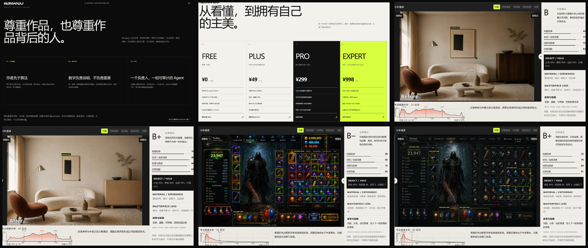
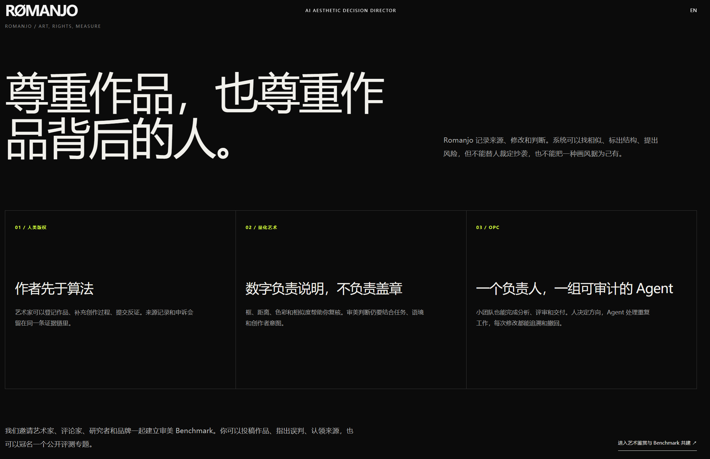
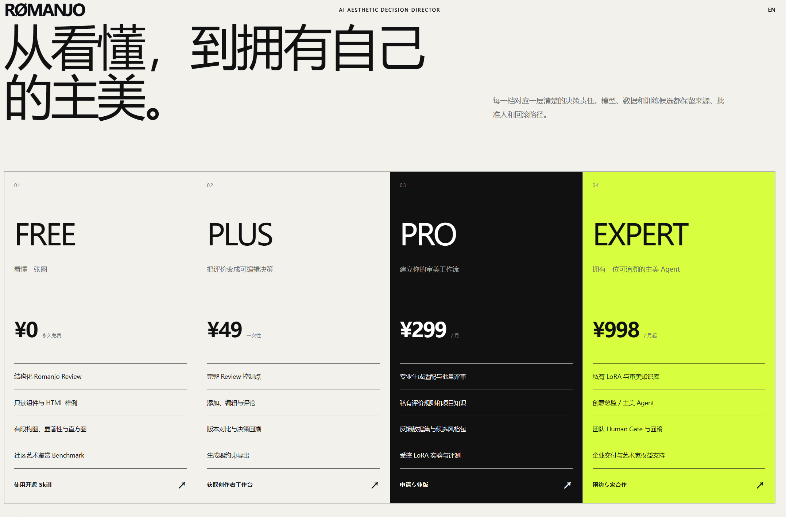
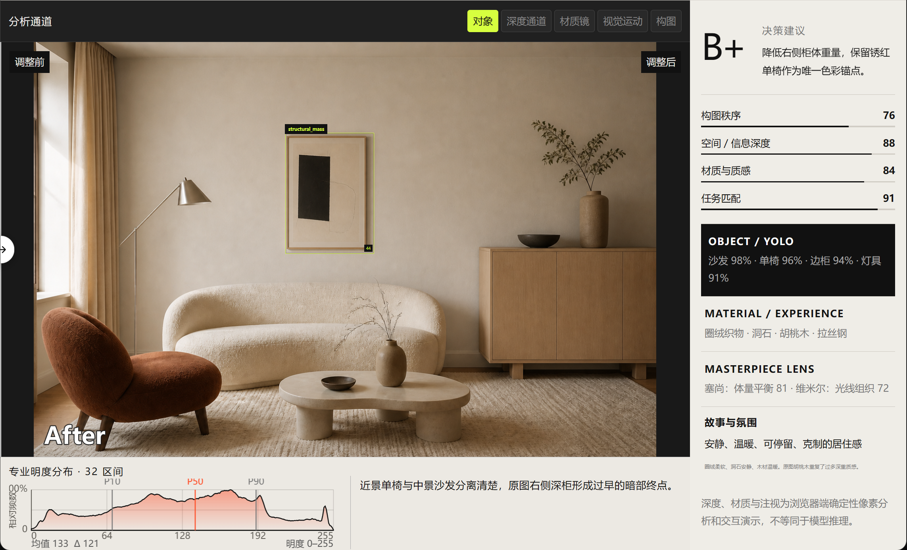
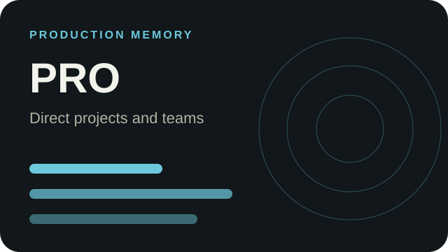
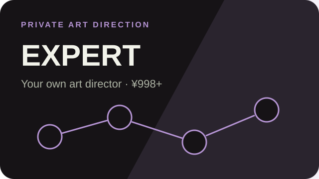
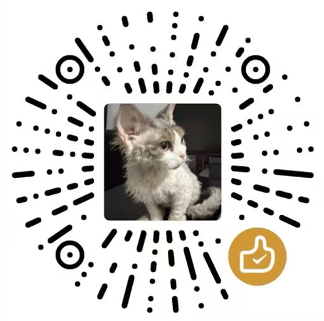

<div align="center">
  
  <h1>Romanjo Art QA</h1>
  <p><strong>从看懂，到拥有自己的主美。<br>From understanding the image to having your own art director.<br>画像を読み解くところから、自分専属のアートディレクターへ。</strong></p>
  <p><a href="#中文">中文</a> · <a href="#english">English</a> · <a href="#日本語">日本語</a></p>
</div>



Banner 来自主站的真实工作台演示：左侧是室内图的对象、构图与明度证据，右侧是游戏 UI 的节奏框、评分与评论。Romanjo Art QA 把这类评价整理为可检查的数据和下一轮修改方向。公开仓库提供 Agent Skill、Schema 与只读前端 Kit。完整工作台、商业 MCP、私有评价规则、生成接入与训练系统保留在商业工程。

| 主站理念 / Principles | 产品档位 / Access | 工作台实证 / Evidence desk |
|---|---|---|
| [](assets/screens/rights-and-measure.png) | [](assets/screens/access-levels.png) | [](assets/screens/workbench-interior-after.png) |

## 四档产品 / Four plans / 4つのプラン

| | | |
|---|---|---|
| [](#free) | [](#plus) | |
| [](#pro) | [](#expert) | |

<a id="free"></a>
### FREE · 公开学习版 / Public learning / 公開学習版

你可以用公开 Skill 生成结构化 Review JSON，并用只读 Kit 查看焦点、构图线、深度区域和直方图。适合学习、开源实验和 benchmark 投稿。它不编辑控制点，不连接生成服务，也不把图片用于训练。

Use the public Skill to create structured Review JSON and inspect attention, composition lines, depth regions, and histograms in the read-only kit. It does not edit controls, connect to generation providers, or train on your image.

公開 Skill で Review JSON を作成し、注視候補、構図線、奥行き領域、ヒストグラムを閲覧できます。コントロール編集、生成サービス接続、画像学習は行いません。

<a id="plus"></a>
### PLUS · ¥49 买断 / one-time / 買い切り

面向个人创作者。你可以编辑评价控制点、补充评论、比较版本并导出给下一轮创作使用的方向。公开仓库不包含这些闭源组件；付费内容通过商业版本交付。

For individual creators who need editable review controls, comments, version comparison, and direction exports for the next creative pass. These closed components ship through the commercial product.

個人制作者向けです。評価ポイントの編集、コメント、バージョン比較、次の制作に使う指示の書き出しに対応します。これらは商用版で提供します。

<a id="pro"></a>
### PRO · ¥299/月 / month / 月

面向专业创作者和小团队。提供项目历史、可复用主美方向、团队评审、批量资产管理和生产连接。团队仍然决定最终评价与发布结果。

For professionals and small teams that need project history, reusable art direction, team review, batch asset management, and production connections. Your team keeps final approval.

プロと小規模チーム向けです。案件履歴、再利用できるアート方針、共同レビュー、素材管理、制作連携を扱います。最終判断はチームが行います。

<a id="expert"></a>
### EXPERT · ¥998/月起 / from ¥998 per month / 月額¥998から

面向工作室与企业。基于获授权的私有作品、反馈和审美知识定制主美 Agent，包含数据治理、权限、评测、人工审批和交付支持。范围、训练许可、部署方式和服务标准按项目确认。

For studios and enterprises that want a tailored art-director agent built from authorized private work, feedback, and aesthetic knowledge. Scope, training permission, deployment, evaluation, human approval, and support are agreed per project.

スタジオと企業向けです。許諾済みの非公開作品、フィードバック、美的知識を基に専用アートディレクター Agent を設計します。学習許諾、導入、評価、人の承認、サポート範囲は案件ごとに合意します。

## 详细能力对照 / Detailed capability matrix / 機能比較

| 能力 / Capability / 機能 | FREE | PLUS ¥49 | PRO ¥299/月 | EXPERT ¥998/月起 |
|---|:---:|:---:|:---:|:---:|
| 结构化图片 Review / Structured review / 構造化レビュー | ✓ | ✓ | ✓ | ✓ |
| 公开 Schema 与只读 Kit / Public schema + read-only kit / 公開 Schema + 閲覧 Kit | ✓ | ✓ | ✓ | ✓ |
| 焦点、构图、深度、色彩证据 / Attention, composition, depth, color / 注視・構図・奥行き・色 | 基础 / Basic | 完整查看 / Full view | 项目级 / Project | 定制 / Tailored |
| 编辑控制点与评价 / Edit controls and comments / 制御点と評価の編集 | — | ✓ | ✓ | ✓ |
| 版本对比与方向导出 / Version comparison + direction export / 比較と指示出力 | — | ✓ | ✓ | ✓ |
| 项目历史与可复用方向 / Project history + reusable direction / 案件履歴と方針再利用 | — | — | ✓ | ✓ |
| 团队评审与权限 / Team review + permissions / 共同レビューと権限 | — | — | ✓ | ✓ |
| 生产工具连接 / Production connections / 制作ツール連携 | — | — | ✓ | 定制 / Tailored |
| 私有审美知识 / Private aesthetic knowledge / 非公開の美的知識 | — | — | — | ✓ |
| 定制主美 Agent / Tailored art-director agent / 専用アートディレクター Agent | — | — | — | ✓ |
| 获授权数据的定制训练 / Training on authorized data / 許諾データによる学習 | — | — | — | 可选 / Optional |
| 人工审批与回滚 / Human approval + rollback / 人の承認とロールバック | — | 本地确认 / Local | 团队审批 / Team | 治理流程 / Governed |
| 支持方式 / Support / サポート | 社区 / Community | 文档 / Docs | 优先 / Priority | 项目服务 / Project |

价格为当前计划，最终购买页或项目报价为准。PLUS 是个人许可；PRO 与 EXPERT 的席位、部署和服务范围另行确认。商业合作请开 [Proposal Issue](https://github.com/Hikohikoyan/romanjo-art-qa/issues/new/choose)，不要在公开 Issue 留下机密资料。

Prices describe the current plan and may change before purchase. PLUS covers an individual license. PRO and EXPERT seats, deployment, and service scope require confirmation. Open a [Proposal Issue](https://github.com/Hikohikoyan/romanjo-art-qa/issues/new/choose) without confidential information.

価格は現行案です。購入時の表示または個別見積もりを優先します。PLUS は個人ライセンスです。PRO と EXPERT の席数、導入、支援範囲は個別に確認します。

## 中文

### 快速使用

```bash
git clone https://github.com/Hikohikoyan/romanjo-art-qa.git romanjo-review
python -m http.server 8000 --directory romanjo-review/assets
```

打开 `http://127.0.0.1:8000/demo.html`。也可以让支持 Skill 的 Agent 安装本仓库，然后附图请求 Romanjo Review JSON。

免费示例在浏览器内读取既有 Review 数据。它不运行闭源分析，不调用生成服务，不编辑商业控制点，也不训练作品。公开输出将观察证据和解释分开记录，方便你复核评价依据。

### 艺术家权益与共建

Issues 是公开鉴赏与 benchmark 共建入口。欢迎艺术家投稿已获授权的作品，评价家和策展人提交难例，研究者报告误判。Romanjo 可以整理内容凭证、作者声明、来源记录与相似性候选，但相似不等于抄袭，分数不能确认作者或替代版权判断。争议结果需要人工复核、反证和更正路径。请阅读[公开证据协议](references/provenance-and-similarity.md)。

我们接受艺术家网络、评价家网络、展览、研究和冠名专题合作。赞助方不能购买标签、阈值或结论。

### Issue 怎么参与，为什么值得参与

公开讨论的价值来自可复核的分歧。每个 Issue 只处理一个问题，发起人要说明作品来源、画面证据和什么结果会改变自己的判断。

| Issue 类型 | 你提交什么 | 社区形成什么 |
|---|---|---|
| Artwork review | 获授权作品、作者署名、一个具体评审问题 | 一份区分观察、解释和修改建议的公开评论记录 |
| Open review | 第一眼判断、相反解释、一个可验证修改 | 能被设计实践者重复检验的审美讨论 |
| Benchmark case | 明确任务、可见锚点、已知陷阱、反例 | 带版本和争议记录的测试案例，而不是无来源分数 |
| False positive | 错误结论、反证、建议改写 | 误判档案与回归样本，防止同类问题重复出现 |
| Artist rights | 来源、时间线、授权或更正请求 | 人工复核、异议和修订记录，不发布自动侵权裁决 |
| Proposal | 研究、评价家网络、专题或商业试点的投入方式 | 有边界的共建任务；赞助、排名和结论分开管理 |

Issue 中的作品默认不进入训练。只有权利人另行给出明确训练许可，并通过来源、用途、退出和保留期审核后，样本才可能进入候选数据集。

### 研究与产品路线

[ROADMAP.md](ROADMAP.md) 记录公开研究方向与共建门槛。近期重点是中西方艺术分析、空间设计理论、设计思维、视觉思维与视觉还原；随后扩展大众审美趋势、文化内核、图样纹样分析。基础风格 LoRA 只使用明确授权的数据，训练完成后还要经过留出集、负迁移检查和主美 Human Gate。

## English

### Quick start

```bash
git clone https://github.com/Hikohikoyan/romanjo-art-qa.git romanjo-review
python -m http.server 8000 --directory romanjo-review/assets
```

Open `http://127.0.0.1:8000/demo.html`, or ask a Skill-capable agent to install this repository and review an attached image. The free page renders an existing artifact in your browser. It does not run private analysis, call a generation provider, edit commercial controls, or train on artwork.

### Artist rights and benchmark work

Use Issues to submit rights-cleared art, propose hard review cases, and report false positives. Romanjo can organize Content Credentials, creator declarations, source records, and similarity leads. Similarity does not prove copying or identify an artist. Contested findings require human review, counter-evidence, and correction. Read the [public evidence protocol](references/provenance-and-similarity.md).

Artists, critics, curators, and researchers can join the reviewer network. We also discuss exhibitions, research, and named benchmark sponsorships. Sponsors cannot purchase labels, thresholds, or outcomes.

See [ROADMAP.md](ROADMAP.md) for the contribution tracks, evidence requirements, and governed path from authorized references to evaluated base-style LoRA candidates.

## 日本語

### クイックスタート

```bash
git clone https://github.com/Hikohikoyan/romanjo-art-qa.git romanjo-review
python -m http.server 8000 --directory romanjo-review/assets
```

`http://127.0.0.1:8000/demo.html` を開くか、Skill 対応 Agent にこのリポジトリを導入して画像レビューを依頼してください。無料ページは既存の Review データをブラウザ内で表示します。非公開分析、生成サービス、商用コントロール編集、作品学習は行いません。

### 作家の権利と benchmark

Issues では、権利確認済み作品の投稿、難しい評価事例、誤検出報告を受け付けます。Romanjo は Content Credentials、作者申告、出典、類似候補を整理できます。類似性だけで盗用や作者を断定できません。異議がある結果には、人による再確認、反証、訂正手続きを用意します。[公開エビデンス手順](references/provenance-and-similarity.md)も確認してください。

作家、評論家、キュレーター、研究者のネットワーク参加を歓迎します。展覧会、研究、冠名 benchmark も相談できます。スポンサーは評価ラベル、基準値、結論を購入できません。

研究テーマ、Issue の提出物、許諾済み資料から評価済み基礎スタイル LoRA 候補までの手順は [ROADMAP.md](ROADMAP.md) に記載しています。

## 自愿赞赏 / Voluntary support / 任意の支援



如果免费 Skill 对你有帮助，可以自愿赞赏。谢谢你支持文档、示例和社区维护。赞赏不会影响 benchmark 评价、投稿排序、申诉处理或艺术家权益判断。

If the free Skill helped you, you may support its public documentation and community maintenance. Support never changes benchmark judgments, submission order, appeals, or artist-rights handling.

無料 Skill が役立った場合は、公開資料とコミュニティ運営を任意で支援できます。支援の有無は評価、投稿順、異議申立て、作家の権利対応に影響しません。

## Public repository boundary

This repository contains `SKILL.md`, the public review schema and field guide, the provenance protocol, a sample artifact, and a reduced read-only browser renderer. It excludes the private workbench, commercial MCP, internal rubrics, provider integrations, model weights, training systems, and proprietary aesthetic knowledge.

Review [SECURITY.md](SECURITY.md) and [CONTRIBUTING.md](CONTRIBUTING.md) before sharing material. Artwork keeps its stated rights; opening an Issue does not grant model-training permission. Code and documentation use the [GNU Affero General Public License v3.0](LICENSE).
